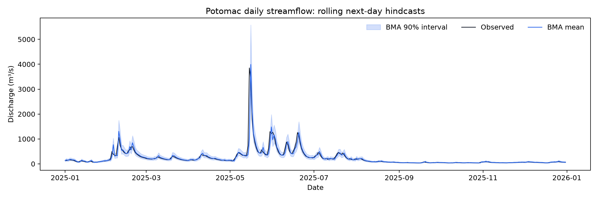

# First streamflow experiment

Run date: 8 October 2026. USGS 01646500, daily next-day hindcasts, seed 42.

Training: 1990–2009. Validation: 2010–2014. BMA and mean calibration: 2015–2019. Test: 2020–2025 (2,192 forecasts).

| Model | RMSE (m³/s) | MAE (m³/s) | NSE | KGE (2009) |
| --- | ---: | ---: | ---: | ---: |
| persistence | 145.79 | 48.54 | 0.7619 | 0.8809 |
| lstm | 121.31 | 40.71 | 0.8351 | 0.9128 |
| stacked_lstm | 111.22 | 37.89 | 0.8614 | 0.9143 |
| bilstm | 121.57 | 40.29 | 0.8344 | 0.9143 |
| transformer | 116.79 | 40.32 | 0.8472 | 0.9031 |
| equal_average | 115.14 | 39.44 | 0.8515 | 0.9197 |
| bma | 111.87 | 37.79 | 0.8598 | 0.9160 |

Stacked LSTM had the lowest RMSE. BMA had the lowest MAE, while equal averaging had the highest KGE; its RMSE was slightly higher than stacked LSTM. These results do not show universal superiority of BMA.

BMA 90% interval coverage: 92.97%. Mean interval width: 156.39 m³/s. Coverage exceeded the nominal 90% on this test period. Shared log-space variance is a restrictive uncertainty model; flow-dependent residuals and flood-event coverage still need study.

| Component | BMA weight |
| --- | ---: |
| lstm | 0.000272 |
| stacked_lstm | 0.767062 |
| bilstm | 0.066945 |
| transformer | 0.165721 |

EM convergence flag: `True` after 1815 iterations. A near-zero weight means little incremental calibration-period mixture support, not a proof that an architecture is generally useless.

## What this run establishes

The four networks train, generate aligned forecasts and feed an independently calibrated probability mixture. Persistence and equal averaging are included. Test targets were not used for scaling, network selection or BMA fitting.

## What remains untested

- Multiple seeds and rolling-origin splits, other catchments and out-of-site transfer.
- Longer forecast lead times and meteorological predictors available at issue time.
- A larger prespecified training/tuning budget and matched-capacity comparisons.
- Estimated-flow exclusion sensitivity, flood/low-flow scores, probabilistic proper scores and interval calibration by flow regime.
- Fully Bayesian uncertainty in fitted network and ensemble parameters.

This is an initial historical benchmark, not an operational forecast system or a finished research validation. All models were capped at 20 epochs; several were still improving on validation near that cap. Future tuning should reserve a new untouched test period rather than repeatedly optimizing against these published test results.

The source response and processed-data hashes are recorded in `data/manifest.json` and `run.json`. Saved daily test and calibration forecasts allow the reported scores and mixture fitting to be audited.
